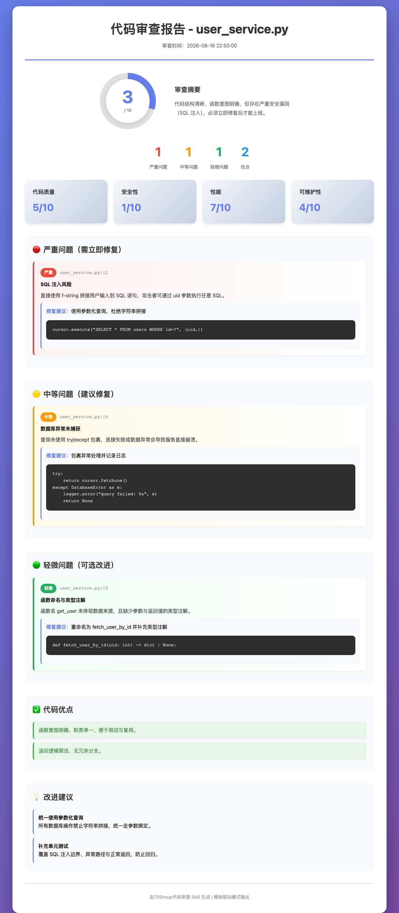

<p align="center">
  
  
  
  
</p>

<p align="center">
  <strong>English</strong> | <a href="README.zh.md">中文</a>
</p>

# @7dgroup/dsh-skill-7d-code-reviewer

> A template-driven code review skill plugin for DeepSeek Harness: five-step review flow, critical/medium/minor severity grading, four-dimension scoring, and dual text + HTML report output.
> Pure composable bundle — zero core changes. Install to enable; remove the bundle row to uninstall.
> Maintained by 7DGroup · MIT · [Gitee](https://gitee.com/zuozewei/dsh-skill-7d-code-reviewer)


## ✨ Core Capabilities

- **Template-driven mode** — separation of concerns: `SKILL.md` decides what to review and how severe it is, `templates/` only presents. The HTML report template is pure placeholders, all placeholders must be filled, and every dynamic value is HTML-escaped.
- **Five-step review flow** — accept the task → quick scan → line-by-line review (loading `references/` on demand) → severity grading → report generation.
- **Three-level severity grading** — 🔴 critical (must fix) / 🟡 medium (should fix) / 🟢 minor (optional polish).
- **Four-dimension scoring** — code quality / security / performance / maintainability, each on a 1–10 scale, plus an overall score and an auto-generated summary.
- **Dual output** — a text summary for quick reading, plus a full HTML report saved as `code-review-report-{timestamp}.html`.
- **Built-in knowledge base** — coding standards, security checklist (SQL injection, XSS, authentication/authorization, sensitive-data leaks) and worked review examples, loaded on demand instead of bloating the prompt.

## 📸 Preview

A sample HTML report generated from the pure-placeholder template (`templates/report-template.html`) during a review of a small Python module — severity badges, four-dimension scores and fix suggestions are all filled by the model:

<p align="center">
  
</p>

## 🔍 The Review Flow

| Step | What happens |
|---|---|
| 1. Accept the task | Take the submitted code or file paths; determine the language and business context |
| 2. Quick scan | Classify the change (new feature / bugfix / refactor); locate the core files and key logic |
| 3. Line-by-line review | Load the matching references on demand; check naming, security, performance and error handling |
| 4. Severity grading | 🔴 critical — must fix · 🟡 medium — should fix · 🟢 minor — optional improvement |
| 5. Report generation | Fill the placeholder HTML template; output the text summary plus `code-review-report-{timestamp}.html` |

## 🚀 Quick Start

Prerequisites: `dsh` CLI, Node `^22.19.0 || >=24.0.0`, pnpm 10+.

### Install from Gitee (git)

`dsh plugin` appends the bundle to the profile's `dsh.profile.bundles`, and the bundle's own patch layer mounts the `skill-7d-code-reviewer` row over the base composition:

```sh
dsh plugin --profile <name> add git+https://gitee.com/zuozewei/dsh-skill-7d-code-reviewer.git
```

Any git spec pnpm understands works; if this repository is mirrored to GitHub, the `github:<owner>/dsh-skill-7d-code-reviewer` shorthand is equivalent.

pnpm blocks a git dependency's build scripts until explicitly allowed, so the first `add` fails. Copy the exact package key pnpm printed into the profile's `pnpm-workspace.yaml`, then re-run:

```yaml
allowBuilds:
  '@7dgroup/dsh-skill-7d-code-reviewer@git+https://gitee.com/zuozewei/dsh-skill-7d-code-reviewer.git#<sha>': true
```

Allowing a build means letting that package's code run on your machine at install time, outside any agent sandbox. Prefer pinning a commit (`...#<sha>`) so later pushes cannot silently change what runs.

### Install without build approval

Two forms ship prebuilt code and need no allowance:

```sh
dsh plugin --profile <name> add @7dgroup/dsh-skill-7d-code-reviewer     # npm (once published)
dsh plugin --profile <name> add ./7dgroup-dsh-skill-7d-code-reviewer-0.1.0-rc.5.tgz   # tarball from pnpm pack
```

Build the tarball locally with `pnpm build` followed by `pnpm pack --pack-destination <dir>`; the archive carries `lib/`, `cordis.patch.yml`, `assets/` and the package metadata.

## 💡 Usage

Once installed, the skill registers itself under the name `7d-code-reviewer` and activates whenever you ask for a code review — for example:

> Review this code: ...

It then produces:

1. **Text summary** — ✅ strengths, ⚠️ issues grouped by severity (each with location, description and fix suggestion), 📊 overall score plus the four dimension scores.
2. **HTML report** — the placeholder template filled in, saved to `code-review-report-{timestamp}.html`, with the file path reported to you.

## 🧩 Skill Assets

```
assets/7d-code-reviewer/
├── SKILL.md                         # review logic + template selection
├── references/                      # knowledge base, loaded on demand
│   ├── coding-standards.md          # naming rules, code complexity
│   ├── security-checklist.md        # SQL injection, XSS, auth, leaks
│   └── review-examples.md           # worked review examples
├── templates/
│   └── report-template.html         # pure-placeholder HTML report
└── scripts/
    └── html-report-generation.md    # HTML escaping rules for filled content
```

No executable scripts ship with the skill; the report template stays pure placeholders, and the escaping rules live in `scripts/html-report-generation.md`.

## 📚 Documentation

| Topic | Content |
|---|---|
| [AGENTS.md](AGENTS.md) | Repo purpose, structure, build/packaging rules and development conventions |

## 🛠️ Development

```sh
pnpm install
pnpm build   # tsdown; also runs as the `prepare` hook on git installs
pnpm test    # vitest
```

The git install clones this repository without `lib/` and runs `prepare` (tsdown with the dedicated config): it transpiles `src/` only, without project references or type checking, keeping peer dependencies external. No lint or typecheck scripts are configured — the build is transpile-only (`dts: false`), so type errors surface in the editor/IDE.

Commit messages follow a Simplified Chinese convention: a `【类型】简短描述` title (at most 50 characters, no trailing punctuation) using one of the nine fixed type tags (【新增】【修复】【优化】【调整】【删除】【文档】【测试】【回滚】【合并】); complex changes list numbered detail lines after a blank line.

## ⚠️ Known Limitations

- The provider contributes one fixed skill and has no runtime customization.
- Report quality depends on the model following the placeholder-filling and HTML-escaping rules; nothing validates the generated report.
- The prepared build ships no type declarations; the dsh Loader loads the runtime entry only.
- The build does not type-check; type errors only show up in the editor/IDE.

## 📄 License

[MIT](LICENSE) · Copyright (c) 2026 7DGroup
