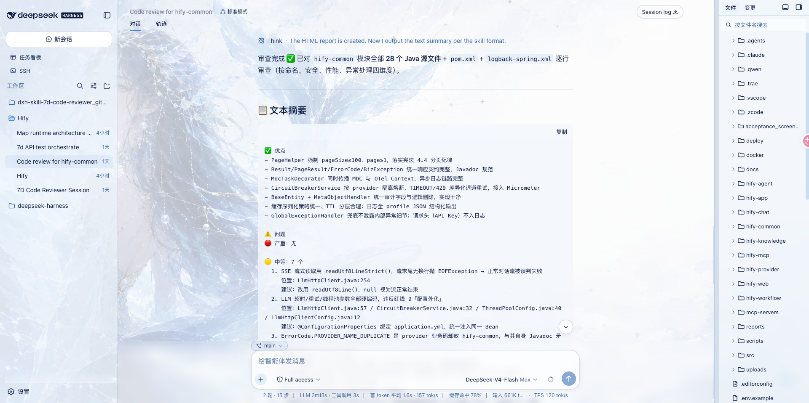

<p align="center">
  
  
  
  
</p>

<p align="center">
  <a href="README.md">English</a> | <strong>中文</strong>
</p>

# @7dgroup/dsh-skill-7d-code-reviewer

**作者: 7DGroup**

这是一个专业级的 DSH（DeepSeek Harness）代码审查技能插件，由 7DGroup 团队开发，专为 AI 辅助代码审查场景设计。基于 TypeScript + Cordis 开发，以组合包（bundle）形式安装，通过 `ctx.skills` 注册 `7d-code-reviewer` 技能：五步审查流程、严重/中等/轻微三级问题分级、四维度评分标准，文本摘要与 HTML 报告双输出。零核心改动——安装即启用，移除 bundle 行即卸载。

---
## 📌 项目信息

| 项目 | 值 |
|---|---|
| 作者 | 7DGroup |
| 版本 | 0.1.0-rc.5 |
| 运行环境 | Node `^22.19.0 || >=24.0.0` · pnpm 10+ · dsh CLI |
| Peer 依赖 | `@deepseek-ai/cordis` · `@deepseek-ai/dsh-skill` · `@deepseek-ai/dsh-invariants` |
| 技能名称 | `7d-code-reviewer` |
| 仓库地址 | [github.com/7dgroup-ai/dsh-skill-7d-code-reviewer](https://github.com/7dgroup-ai/dsh-skill-7d-code-reviewer) |
| 许可证 | MIT |

## 🖼️ 插件效果

在 dsh 会话中调用技能：



由纯占位符模板生成的 HTML 报告示例：


**核心能力**：

- **模板驱动模式**——职责分离：`SKILL.md` 决定审什么、多严重，`templates/` 只负责呈现。HTML 报告模板保持纯占位符，所有占位符必须填充，动态内容一律 HTML 转义。
- **五步审查流程**——接收任务 → 快速浏览 → 逐行审查（按需加载 `references/`）→ 问题分级 → 生成报告。
- **三级问题分级**——🔴 严重（必须修复）/ 🟡 中等（建议修复）/ 🟢 轻微（可选改进）。
- **四维度评分标准**——代码质量 / 安全性 / 性能 / 可维护性，各维度 1–10 分，另有总体评分与自动生成的摘要描述。
- **双格式输出**——文本摘要供快速浏览，完整 HTML 报告另存为 `code-review-report-{时间戳}.html`。
- **内置知识库**——编码规范、安全检查清单（SQL 注入、XSS、认证授权、敏感信息泄露）与审查示例，按需加载而不撑大提示词。
- **零核心改动**——纯组合包挂载，不打 DSH 核心补丁，安装与卸载均安全。

**应用场景**：

- 提交 / 合并请求前的代码审查
- 存量代码的安全审计
- 重构前的代码质量评估
- 团队编码规范的落地执行
- dsh 对话中的任意代码质量咨询

## ✅ 功能特性

- ✅ 五步模板驱动审查流程
- ✅ 三级问题分级与修复建议
- ✅ 四维度评分标准（代码质量 / 安全性 / 性能 / 可维护性）
- ✅ 文本摘要 + HTML 报告双格式输出
- ✅ 纯占位符 HTML 报告模板与强制填充规则
- ✅ 填充内容 HTML 转义规则文档化
- ✅ 按需加载的知识库（编码规范 / 安全检查清单 / 审查示例）
- ✅ 技能包不附带任何可执行脚本
- ✅ 支持 GitHub（`github:` 简写）、npm、tarball 三种安装方式
- ✅ git 安装构建自包含（`prepare` 钩子，仅转译）

## 📂 项目结构

```
dsh-skill-7d-code-reviewer/
├── src/                                # 源代码目录
│   ├── index.ts                        # Cordis 插件：注册技能提供者
│   └── invariant.ts                    # 伴生插件：包所有权不变量
├── assets/7d-code-reviewer/            # 随包发布的技能资源
│   ├── SKILL.md                        # 审查逻辑 + 模板选择决策
│   ├── references/                     # 知识库（按需加载）
│   │   ├── coding-standards.md         # 命名规范、代码复杂度
│   │   ├── security-checklist.md       # SQL注入、XSS、认证授权、泄露检查
│   │   └── review-examples.md          # 审查示例参考
│   ├── templates/
│   │   └── report-template.html        # 纯占位符 HTML 报告模板
│   └── scripts/
│       └── html-report-generation.md   # 填充内容的 HTML 转义规则
├── tests/                              # vitest 测试
│   └── skill-7d-code-reviewer.spec.ts
├── screenshots/                        # README 截图
│   ├── skills.png                      # 技能调用
│   └── report-preview.png              # HTML 报告示例
├── cordis.patch.yml                    # 组合层补丁
├── tsdown.config.ts                    # 构建配置（仅转译）
├── 7dgroup-dsh-skill-7d-code-reviewer-0.1.0-rc.5.tgz   # 预构建 tarball
├── package.json
└── README.md
```

## 🚀 快速开始

前置条件：`dsh` CLI、Node `^22.19.0 || >=24.0.0`、pnpm 10+。

### 在 dsh 中直接安装（推荐）

一条命令直接安装，`github:` 简写是最快捷的方式：

```sh
dsh plugin --profile <name> add github:7dgroup-ai/dsh-skill-7d-code-reviewer
```

完整 URL 写法等价：

```sh
dsh plugin --profile <name> add git+https://github.com/7dgroup-ai/dsh-skill-7d-code-reviewer.git
```

`dsh plugin` 会把 bundle 追加进 profile 的 `dsh.profile.bundles`，本 bundle 自带的 patch 层在基础组合之上挂载 `skill-7d-code-reviewer` 行。

pnpm 在得到显式允许前会拒绝运行 git 依赖的构建脚本，所以第一次 `add` 会失败。把 pnpm 打印的确切包键复制进该 profile 的 `pnpm-workspace.yaml`，然后重新执行：

```yaml
allowBuilds:
  '@7dgroup/dsh-skill-7d-code-reviewer@git+https://github.com/7dgroup-ai/dsh-skill-7d-code-reviewer.git#<sha>': true
```

（使用 `github:` 简写时，授权键为 `@7dgroup/dsh-skill-7d-code-reviewer@github:7dgroup-ai/dsh-skill-7d-code-reviewer#<sha>` 形式；一律以 pnpm 打印的确切键为准。）

允许构建意味着让该包的代码在安装时于你的机器上执行，且不在任何 agent 沙箱之内。建议锁定 commit（`...#<sha>`），让后续推送无法悄悄改变实际运行的内容。

### 从 tarball 安装（免构建授权）

仓库根目录已附带预构建 tarball——直接下载即可安装：

```sh
dsh plugin --profile <name> add ./7dgroup-dsh-skill-7d-code-reviewer-0.1.0-rc.5.tgz
```

或者发布到 npm 后：

```sh
dsh plugin --profile <name> add @7dgroup/dsh-skill-7d-code-reviewer
```

以上两种形式携带预构建代码，无需 `allowBuilds` 授权。

### 构建与测试

```sh
pnpm install
pnpm build   # tsdown；git 安装时也会以 prepare 钩子运行
pnpm test    # vitest
```

## 💡 使用方式

技能在你提出代码审查需求时自动生效，既可以用斜杠命令，也可以直接自然语言描述：

> /7d-code-reviewer 审查这个模块：……

五步审查流程：

| 步骤 | 做什么 |
|---|---|
| 1. 接收审查任务 | 接收用户提交的代码或文件路径；确定语言与业务场景 |
| 2. 快速浏览 | 判断改动性质（新业务 / 修 bug / 重构）；识别核心文件与关键逻辑 |
| 3. 逐行审查 | 按需加载对应 references；逐项检查命名、安全、性能与异常处理 |
| 4. 问题分级 | 🔴 严重——必须修复 · 🟡 中等——建议修复 · 🟢 轻微——可选改进 |
| 5. 生成报告 | 填充占位符 HTML 模板；输出文本摘要与 `code-review-report-{时间戳}.html` |

### 输出示例（文本摘要）

```
✅ 优点
- 函数意图明确，返回用户数据

⚠️ 问题
🔴 严重：SQL 注入风险
  位置：get_user() 第 2 行
  描述：直接使用 f-string 拼接用户输入到 SQL 语句
  建议修复：使用参数化查询，如 cursor.execute("SELECT * FROM users WHERE id=?", [uid])

📊 总体评分：3/10
   代码质量: 5/10 | 安全性: 1/10 | 性能: 7/10 | 可维护性: 4/10
```

完整 HTML 报告保存为 `code-review-report-{时间戳}.html`，并告知你报告文件路径。

## 📊 分级与评分标准

问题分级：

| 级别 | 标识 | 定义 | 处理要求 |
|---|---|---|---|
| 严重 | 🔴 | 安全漏洞、崩溃风险 | 必须修复 |
| 中等 | 🟡 | 性能隐患、逻辑缺陷 | 建议修复 |
| 轻微 | 🟢 | 命名优化、注释补充 | 可选改进 |

四维度评分（各维度 1–10 分）：

| 维度 | 优秀(8-10) | 良好(6-7) | 需改进(4-5) | 差(1-3) |
|---|---|---|---|---|
| 代码质量 | 命名清晰，结构合理，无重复代码 | 基本规范，少量问题 | 命名混乱或复杂度过高 | 严重违反编码规范 |
| 安全性 | 无安全风险，参数化查询，完整验证 | 基本安全，小瑕疵 | 存在安全隐患 | 有严重安全漏洞 |
| 性能 | 算法高效，使用缓存，无N+1查询 | 性能可接受 | 有明显性能问题 | 严重性能缺陷 |
| 可维护性 | 文档完善，模块化，测试覆盖高 | 基本可维护 | 缺少注释或测试 | 难以维护 |

总体评分区间：9-10 优秀 · 7-8 良好 · 5-6 中等 · 3-4 较差 · 1-2 很差（必须立即修复）。

## 📈 HTML 报告

- **评分圆环**——总体评分（1-10 分）与自动生成的摘要描述
- **问题统计条**——严重 / 中等 / 轻微问题数量与优点数量
- **维度评分卡片**——代码质量 / 安全性 / 性能 / 可维护性
- **按严重级别分组的问题**——位置、描述与修复建议（含修复代码示例）
- **代码优点与改进建议**章节
- 纯占位符模板——所有占位符必须填充；动态内容按 `scripts/html-report-generation.md` 一律 HTML 转义
- 空章节遵循"无内容填充规则"（如"🎉 未发现严重问题！"）

## ⚠️ 注意事项

1. 该提供方只贡献一个固定 skill，不提供运行时自定义。
2. 报告质量依赖模型遵循占位符填充与 HTML 转义规则；没有任何机制校验生成的报告。
3. prepare 构建不附带类型声明；dsh Loader 只加载运行时入口。
4. 构建只做转译（`dts: false`），没有 lint 或类型检查脚本——类型错误只能在编辑器/IDE 中暴露。
5. 本仓库提交消息遵循简体中文规范：`【类型】简短描述`（九个固定类型标签）。

## ❓ 常见问题

**问：第一次 `dsh plugin add` 为什么失败？**
答：pnpm 在得到显式允许前会拒绝运行 git 依赖的构建脚本。把 pnpm 打印的确切包键复制进该 profile 的 `pnpm-workspace.yaml` → `allowBuilds`，然后重新执行即可。

**问：如何锁定具体 commit？**
答：在地址后追加 `#<sha>`，如 `git+https://github.com/7dgroup-ai/dsh-skill-7d-code-reviewer.git#<sha>`——后续推送无法悄悄改变实际运行的内容。

**问：如何卸载？**
答：从 profile 的 `dsh.profile.bundles` 中移除该 bundle 行即可，不会留下任何核心补丁。

**问：可以不授权构建直接安装吗？**
答：可以——使用仓库根目录的预构建 tarball，或发布后的 npm 包，两者都不需要 `allowBuilds`。

## 📄 许可证

[MIT](LICENSE) · Copyright (c) 2026 7DGroup
